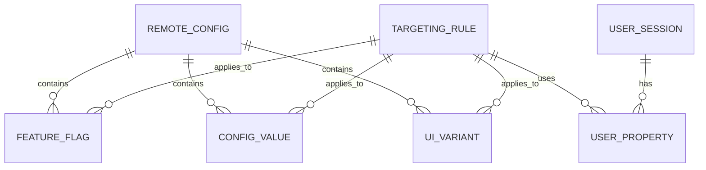

# Data Model: Firebase Remote Config Feature Management

**Feature**: 001-firebase-remote-config  
**Date**: 2026-02-01  
**Status**: Phase 1 Complete

## Overview

This feature uses Firebase Remote Config for data storage, which is a serverless key-value store managed by GCP. The data model describes the conceptual entities and their relationships within the Portal codebase.

## Entities

### 1. Feature Flag

A boolean toggle that controls feature visibility.

| Attribute | Type | Description |
|-----------|------|-------------|
| key | String | Unique identifier following `feat_<name>_enabled` pattern |
| value | Boolean | Current flag state (true = enabled) |
| defaultValue | Boolean | Fallback when remote fetch fails |
| lastFetched | Timestamp | When value was last retrieved from Firebase |

**Naming Convention**: `feat_<feature_name>_enabled`

**Examples**:
- `feat_new_dashboard_enabled`
- `feat_warscribe_beta_enabled`
- `feat_platform_analytics_enabled`

---

### 2. Configuration Value

A numeric or string parameter that influences system behavior.

| Attribute | Type | Description |
|-----------|------|-------------|
| key | String | Unique identifier following `conf_<name>_<type>` pattern |
| value | Number/String | Current configuration value |
| defaultValue | Number/String | Fallback when remote fetch fails |
| lastFetched | Timestamp | When value was last retrieved from Firebase |

**Naming Convention**: 
- Numeric: `conf_<feature_name>_limit` or `conf_<feature_name>_threshold`
- String: `conf_<feature_name>_value`

**Examples**:
- `conf_upload_limit_mb` (Number: 50)
- `conf_cache_ttl_minutes` (Number: 60)

---

### 3. UI Variant

A string value used for A/B testing different UI presentations.

| Attribute | Type | Description |
|-----------|------|-------------|
| key | String | Unique identifier following `ui_<component>_variant` pattern |
| value | String | Current variant identifier |
| defaultValue | String | Fallback variant (usually "default") |
| lastFetched | Timestamp | When value was last retrieved from Firebase |

**Naming Convention**: `ui_<component>_variant`

**Examples**:
- `ui_cta_button_variant` (String: "blue", "red", "default")
- `ui_theme_mode` (String: "dark", "light")

---

### 4. User Property

Custom attributes associated with a user session for targeting.

| Attribute | Type | Description |
|-----------|------|-------------|
| key | String | Property identifier |
| value | String | Property value |
| userId | String | Optional user identifier for targeting |

**Examples**:
- `subscription_tier`: "free", "premium", "enterprise"
- `role`: "member", "admin", "guest"
- `userId`: "user-12345"

---

## Relationships



## State Transitions

### Feature Flag Lifecycle

```
┌──────────┐     Fetch      ┌──────────┐     Activate     ┌──────────┐
│  Default │ ────────────▶  │  Fetched │ ──────────────▶  │  Active  │
└──────────┘                └──────────┘                  └──────────┘
      ▲                                                         │
      │                    Network Error                        │
      └─────────────────────────────────────────────────────────┘
                              (Fallback)
```

### Config Fetch States

| State | Description |
|-------|-------------|
| `UNINITIALIZED` | SDK not yet initialized |
| `FETCHING` | Network request in progress |
| `ACTIVATED` | Remote values active |
| `FAILED_USING_DEFAULTS` | Fetch failed, using defaults |

## Validation Rules

### Key Naming

- Keys MUST match regex: `^(feat|conf|ui)_[a-z_]+_(enabled|limit|threshold|variant|value)$`
- Keys MUST be lowercase with underscores
- Keys MUST NOT exceed 256 characters

### Value Constraints

| Type | Constraint |
|------|------------|
| Boolean | Must be `true` or `false` |
| Number | Must be finite, within JavaScript safe integer range |
| String | Must not exceed 10,000 characters |

## Default Values Map

```javascript
// remote-config.defaults.js
export const REMOTE_CONFIG_DEFAULTS = {
  // Feature Flags
  feat_new_dashboard_enabled: false,
  feat_warscribe_beta_enabled: false,
  feat_platform_analytics_enabled: false,
  
  // Configuration Values
  conf_upload_limit_mb: 50,
  conf_cache_ttl_minutes: 60,
  
  // UI Variants
  ui_cta_button_variant: 'default',
  ui_theme_mode: 'dark'
};
```
